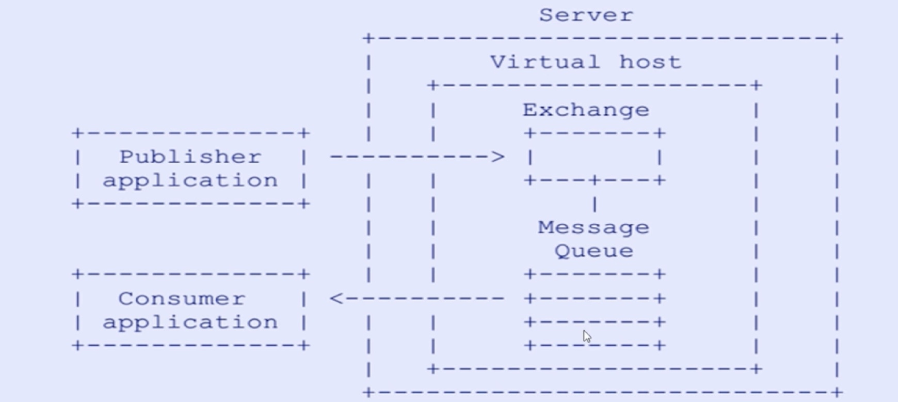
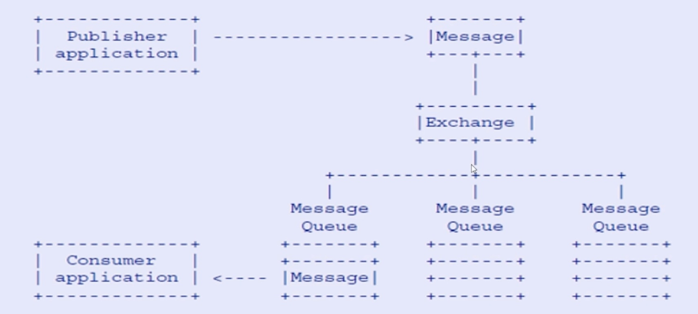
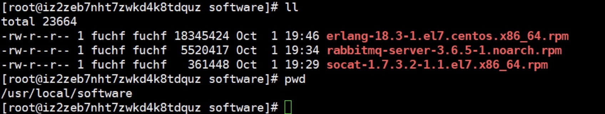
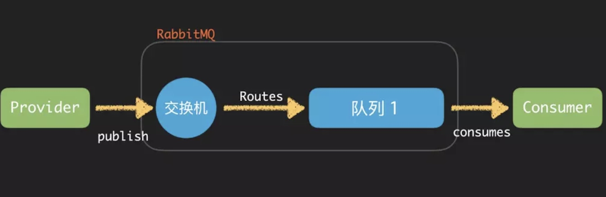
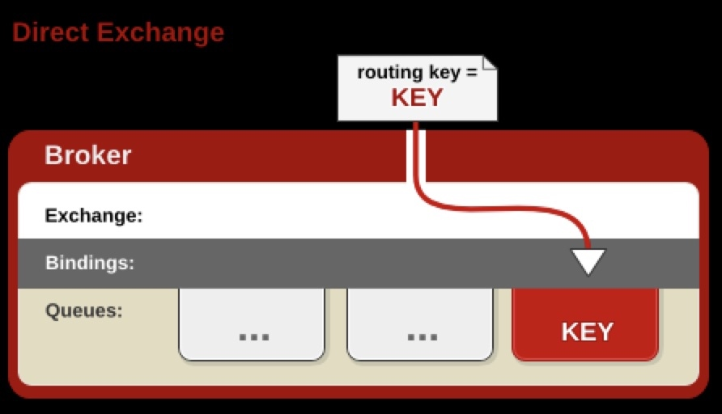
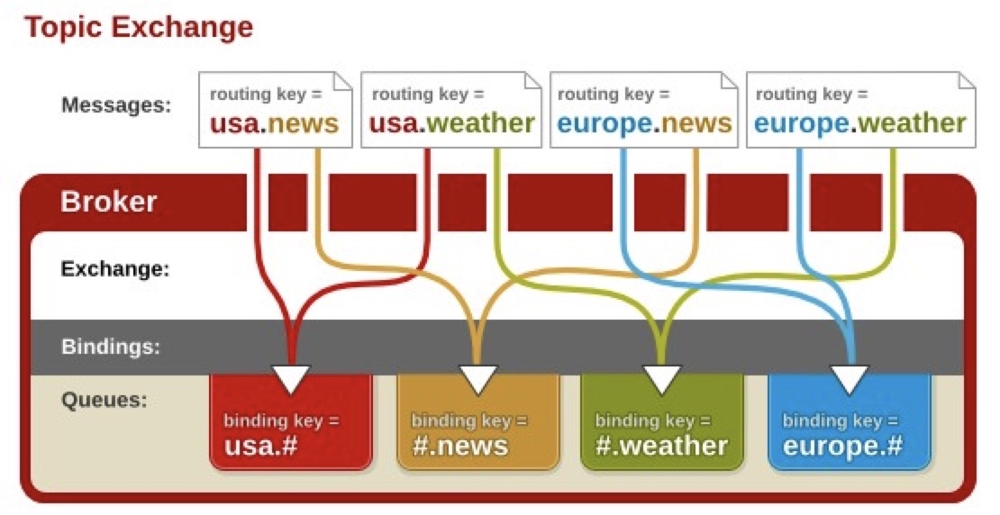
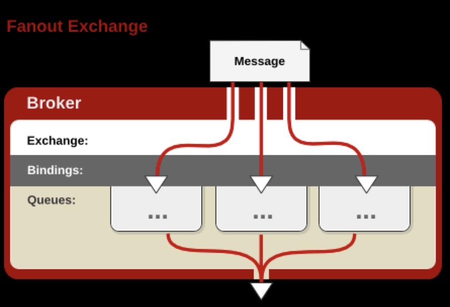

[toc]

## 第2章 低门槛，入门RabbitMQ核心概念
### 2-1 本章导航
- 互联网大厂为什么选择RabbitMQ？
- RabbitMQ的高性能之道是如何做到的？
- 什么是AMQP高级协议？
- AMQP核心概念是什么？
- RabbitMQ整体架构模型是什么样子的？
- RabbitMQ消息是如何流转的？
- RabbitMQ安装与使用
- 命令行与管理台
- RabbitMQ消息生产与消费
- RabbitMQ交换机详解
- RabbitMQ队列、绑定、虚拟主机、消息

### 2-2 哪些互联网大厂在使用RabbitMQ,为什么？
==RabbitMQ==是一个开源的消息代理和队列服务器，用来通过普通协议在完全不同的应用之间共享数据，RabbitMQ是使用Erlang语言来编写的，并且RabbitMQ是基于AMQP协议的。  

**哪些大厂在使用RabbitMQ,为什么？**
- 滴滴、美团、头条、去哪儿、艺龙......
- 开源、性能优秀、稳定性保障
- 提供可靠性消息投递模式（confirm）、返回模式（return）
- 与SpringAMQP完美的整合、API丰富
- 集群模式丰富，表达式配置，HA模式，镜像队列模型
- 保证数据不丢失的前提做到高可靠性、可用性
 
###  2-3 RabbitMQ高性能的原因
  RabbitMQ高性能的原因
- ==Erlang==语言最初在于交换机领域的架构模式，这样使得RabbitMQ在Broker之间进行数据交互的性能是非常优秀的  
- Erlang的优点：Erlang有着和原生Socket一样的延迟

###  2-4 AMQP高级消息队列协议与模型
- AMQP全称：Advanced Message Queuing Protocol
- AMQP定义：是具有现代特征的==二进制协议==。是一个提供统一消息服务的应用层标准高级消息队列协议，是应用层协议的一个开放标准，为面向消息的中间件设计。
#### AMQP协议模型



###  2-5 AMQP核心概念讲解
- 消息（Message）：由有效载荷（playload）和标签（label）组成。其中有效载荷即传输的数据。
- 生产者（producer）：创建消息，发布到代理服务器（Message Broker）。
- 代理服务器（Message Broker）：接收和分发消息的应用，RabbitMQ Server就是消息代理服务器，其中包含概念很多，以RabbitMQ 为例：信道（channel）、队列（queue）、交换器（exchange）、路由键（routing key）、绑定（binding key）、虚拟主机（vhost）等。
- 信道（channel）: 应用程序（生产与 / 或消费）和代理服务器之间 TCP 连接内的虚拟连接，解决 TCP 连接数量限制及降低 TCP 连接代价。每个信道有一个 ID，其概念与 “频分多路复用” 类似。参考上图：AMQP 基本概念
- 队列（queue）：消息最终到达队列中，等待消费者消费。使用 “basic.consume” 订阅可获得队列全部消息，“basic.get”订阅只能获得队列的一条消息（如果队列中存在消息）。如果无人订阅，消息将在队列中存储，等待订阅；如果多个消费者同时订阅该队列，消息将以自动轮询（round-robin）方式发送给消费者（Fanout Exchange，每个消费者只能获得队列中消息的子集）
- 交换器（exchange）：消息到达代理服务器的第一站，根据分发规则，匹配查询表中的（routing key）路由键（Fanout Exchange 除外），分发消息到队列（queue）中去。常用的类型有：direct (point-to-point), topic (publish-subscribe) and fanout (multicast)，请参考 “2.1 交换器”
- 路由键（routing key）：消息发送给交换器时，消息将拥有一个路由键（默认为空），交换器根据这个路由键将消息发送到匹配的队列中。
- 绑定键（binding key）：队列需要通过绑定键（默认为空）绑定到交换器上，交换器将消息的路由键与所绑定队列的绑定键进行匹配，正确匹配的消息将发送到队列中。路由键是偏向生产的概念，而绑定键是偏向消费的概念。
- 虚拟主机（Virtual host，vhost）：虚拟地址，用于进行逻辑隔离，最上层的消息路由。一个Virtual Host里面可以由若干个Exchange和Queue，同一个Virtual Host里面不能有相同名称的Exchange和Queue
- 消费者（consumer）：连接到代理服务器，并订阅到队列（queue）上，代理服务器将发送消息给一个订阅的 / 监听的消费者，消费者其只能接收消息的一部分：有效载荷（playload）。

###  2-6 RabbitMQ整体架构与消息流转
#### RabbitMQ整体架构


#### RabbitMQ消息流转



###  2-7/8 RabbitMQ环境安装
 - 官网地址：[http://www.rabbitmq.com/](http://www.rabbitmq.com/)
 - 提前准备：安装Linux必要依赖包
 - 下载RabbitMQ必须安装包
 - 配置文件修改




```
准备：
yum install 
build-essential openssl openssl-devel unixODBC unixODBC-devel 
make gcc gcc-c++ kernel-devel m4 ncurses-devel tk tc xz

下载：
wget www.rabbitmq.com/releases/erlang/erlang-18.3-1.el7.centos.x86_64.rpm
wget http://repo.iotti.biz/CentOS/7/x86_64/socat-1.7.3.2-5.el7.lux.x86_64.rpm
wget www.rabbitmq.com/releases/rabbitmq-server/v3.6.5/rabbitmq-server-3.6.5-1.noarch.rpm

配置文件：
vim /usr/lib/rabbitmq/lib/rabbitmq_server-3.6.5/ebin/rabbit.app
比如修改密码、配置等等，例如：loopback_users 中的 <<"guest">>,只保留guest
```
>当在前台运行某个作业时，终端被该作业占据；可以在命令后面加上& 实现后台运行。例如：sh test.sh & 
适合在后台运行的命令有find、费时的排序及一些shell脚本。在后台运行作业时要当心：需要用户交互的命令不要放在后台执行，因为这样你的机器就会在那里傻等。 

修改主机名：vim /etc/hostname
rabbitmq 默认java端通信端口：5672   
管控台默认端口 15672
服务的启动 rabbitmq-server start &  
服务的停止 rabbitmqctl app_stop   
管理插件 rabbitmq-plugins enable    rabbitmq_management     
访问地址 https://{{ip 地址}}:15672   
http://39.107.105.180:15672/#/

### 2-9 命令行与管理台结合讲解

命令行与管控台-基础操作
- rabbitmqctrl stop_app:关闭应用
- rabbitmqctl start_app:启动应用
- rabbitmqctl status:节点状态
- rabbitmqctl add_user username password:添加用户
- rabbitmqctl list_users：列出所有用户
- rabbitmqctl delete_user username：删除用户
- rabbitmqctl clear_permissions -p vhostpath username:清除用户权限
- rabbitmqctl list_user_permissions username:列出用户权限
- rabbitmqctl change_password username newpassword:修改密码
- rabbitmqctl set_permissions -p vhostpath username ".*" ".*" ".*":设置用户权限
- rabbitmqctl add_vhost vhostpath:创建虚拟主机
- rabbitmqctl list_vhosts：列出所有虚拟主机
- rabbitmqctl list_permissions -p vhostpath:列出虚拟主机上所有权限
- rabbitmqctl delete_vhost vhostpath：删除虚拟主机
- rabbitmqctl list_queues:查看所有队列信息
- rabbitmqctl -p vhostpath purge_queue blue:清除队列里的消息

命令行与管控台-高级操作
- rabbitmqctl reset：移除所有数据，要在rabbitmqctl stop_app之后使用
- rabbitmqctl join_cluster <clusternode> [--ram]：组成集群命令
- rabbitmqctl cluster_status：查看集群状态
- rabbitmqctl change_cluster_node_type disc|ram:修改集群节点的存储形式
- rabbitmqctl forget_cluster_node [--offline]:忘记节点（摘除节点）
- rabbitmqctl rename_cluster_node oldnode1 newnode1 [oldnode2][newnode2]:修改节点名称

### 2-10/11 生产者消费者模型构建

 #### 急速入门-消息生产与消费
- ConnectionFactory:获取连接工厂
- Connection：一个连接
- Channel：数据通信信道，可发送和接收消息
- Queue：具体的消息存储队列
- Producer&Consumer：生产和消费者

>具体代码详见github

### 2-12~2-14 交换机详解

 Exchange:接收消息，并根据路由键转发消息到所绑定的队列


#### 交换机属性
- Name：交换机名称
- Type：交换机类型direct、topic、fanout、headers
- Durability:是否需要持久化，true为持久化
- Auto Delete:当最后一个绑定到Exchange上的队列删除后，自动删除该Exchange
- Internal：当前Exchange是否用于RabbitMQ内部使用，默认为False
- Arguments：扩展参数，用于扩展AMQP协议自制定化使用

 Direct Exchange
- 所有发送到Direct Exchange的消息被转发到RouteKey中指定的Queue
> 注意：Direct模式可以使用RabbitMQ自带的Exchange:default Exchange，所以不需要将Exchange进行任何绑定（binding）操作，消息传递时，RouteKey必须==完全匹配==才会被队列接收，否则该消息会被抛弃。    



 Topic Exchange
- 所有发送到Topic Exchange的消息被转发到所有关联RouteKey中指定Topic的Queue上
- Exchange将RouteKey和某Topic进行模糊匹配，此时队列需要绑定一个Topic
> 注意：可以使用通配符进行模糊匹配   
"#" 匹配一个或多个词    
"*" 匹配不多不少一个词  
例如： "log.#"能够匹配到"log.info.oa"  
 "log.*"只会匹配到"log.erro"  




 Fanout Exchange
- 不处理路由器，只需要简单的将队列绑定到交换机上
- 发送到交换机的消息都会被转发到与该交换机绑定的所有队列上
- Fanout交换机转发消息时最快的   




### 2-15 绑定、队列、消息、虚拟主机详解
#### Binding-绑定
- Exchange和Exchange、Queue之间的连接关系
- Binding中可以包含RoutingKey或者参数

#### Queue-消息队列
- 消息队列，实际存储消息数据
- Durability：是否持久化，Durable：是；Transient：否
- Auto delete：如选yes，代表当最后一个监听被移除之后，该Queue会自动被删除

#### Message-消息
- 服务器和应用程序之间传送的数据
- 本质上就是一段数据，由Properties和Payload（Body）组成
- 常用属性：delivery mode、headers(自定义属性)

#### Messgae-其他属性
- content_type、content_encoding、priority
- correlation_id、reply_to、expiration、message_id
- timestamp、type、user_id、app_id、cluster_id

#### Virtual host-虚拟主机
- 虚拟地址，用于进行逻辑隔离，最上层的消息路由
- 一个Virtual Host里面可以有若干个Exchange和Queue
- 同一个Virtual Host里面不能有相同名称的Exchange或Queue

### 2-16 本章小结

## 第三章
